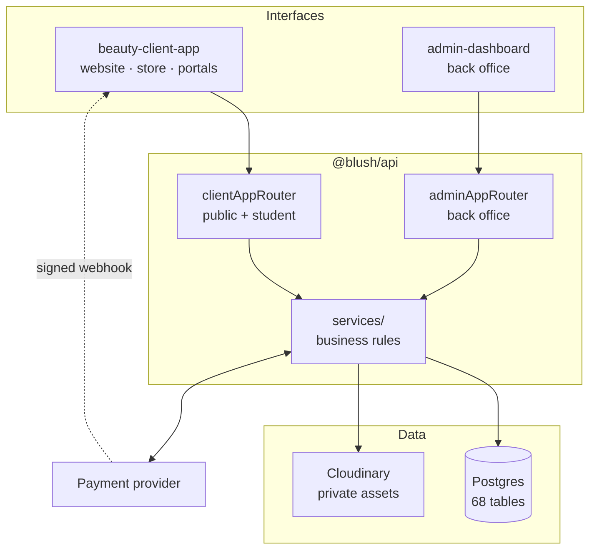
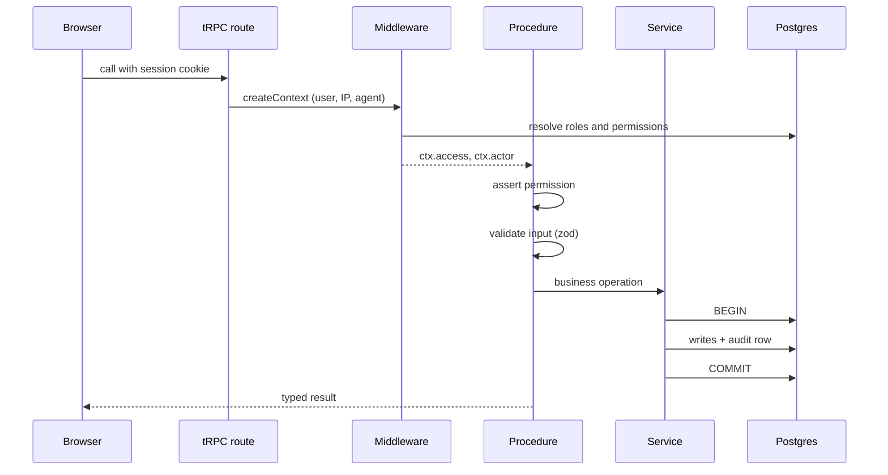

# Architecture

## The shape of the system

Two Next.js applications share one API package and one database. Neither app
owns business logic; both call the same procedures.



Authentication is part of the platform rather than an external dependency:
accounts, password hashes and roles all live in the central database, so there
is no identity provider to configure or stay in sync with.

The two routers exist so the public app cannot even name a back-office
procedure — `clientAppRouter` does not import them. That is defence in depth;
the permission check on each procedure is the actual control.

## A request, end to end



Two things happen in the middleware that matter:

1. **Permissions are resolved once per request** from `userRoles` and
   `rolePermissions`, then attached as `ctx.access`. Procedures call
   `ctx.access.assert(...)`, which throws `FORBIDDEN` before any query runs.
2. **An audit actor is assembled** from the same session — user id, name, IP,
   user agent — so anything the procedure writes can be attributed without the
   caller supplying who they are.

## Where the logic lives

| Layer | Responsibility | Example |
|---|---|---|
| `routers/*` | Validate, authorise, orchestrate | `finance.recordStudentPayment` |
| `services/*` | Business rules, pure where possible | `planAllocation`, `assertTransition` |
| `db/schema/*` | Structure and constraints | unique transaction reference |

Anything that must be *correct* rather than merely *convenient* is pushed into
a service, and where it can be expressed without I/O it is pure and directly
tested. `planAllocation` decides how a payment is split; `allocatePayment` does
the reading and writing around it. That split is why the fee arithmetic has
eleven tests and no database.

## Transaction boundaries

Every operation that touches money or stock runs in one transaction:

```
recordStudentPayment
  BEGIN
    insert payment                        ← unique transaction reference
    allocate across open charges          ← updates amountPaid + status
    insert revenue ledger line            ← linked to the payment
    insert audit row
    notify the student
  COMMIT
```

If any step throws, none of it lands. A balance can therefore never disagree
with the money actually received.

Stock uses the same pattern with an added row lock:

```
applyStockMovement
  SELECT ... FOR UPDATE       ← serialises concurrent checkouts
  check the resulting balance ← refuses to go negative
  UPDATE quantityOnHand
  INSERT movement (with balanceAfter)
```

Without the lock, two checkouts could both read the last unit and both sell it.

## Idempotency

Three places would otherwise double-count:

| Risk | Guard |
|---|---|
| A payment webhook delivered twice | Unique `(provider, eventId)` on `webhookEvents` |
| A customer retrying checkout | Unique `idempotencyKey` on `paymentIntents` |
| Stock deducted twice for one order | `storeOrders.stockDeductedAt` set once |

The capture path locks the payment intent and re-reads its status inside the
transaction, so a duplicate call finds it already succeeded and returns the
original payment instead of writing a second one.

## Deriving rather than accumulating

Rollups such as a customer's lifetime spend are recomputed from their orders
rather than incremented. An incremented counter drifts the first time a refund
is processed out of order; a derived one cannot.

Where a derived value is stored for query performance —
`feeCharges.amountPaid`, `inventoryItems.quantityOnHand` — exactly one code
path writes it, and `pnpm db:reconcile` can rebuild it from the ledger if
anything ever gets in ahead of it.

## Analytics

Every dashboard figure is a query over transaction tables, never a stored
total:

| Metric | Source |
|---|---|
| Income | `sum(revenueTransactions.amount)` |
| Student fees collected | Same, filtered to fee sources |
| Outstanding fees | `sum(amountDue - amountPaid)` over open charges |
| Stock value | `sum(quantityOnHand × unitCost)` |
| Inventory movement | Grouped `inventoryMovements` |

Chart series use a dense month axis, so a quiet month renders as a zero rather
than disappearing and distorting the shape of the line.
