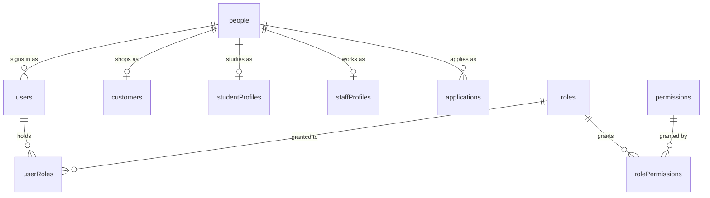
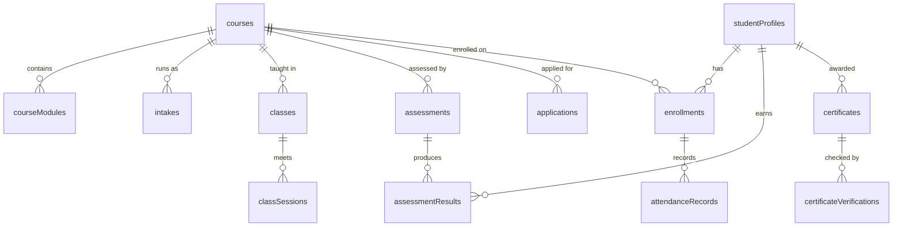
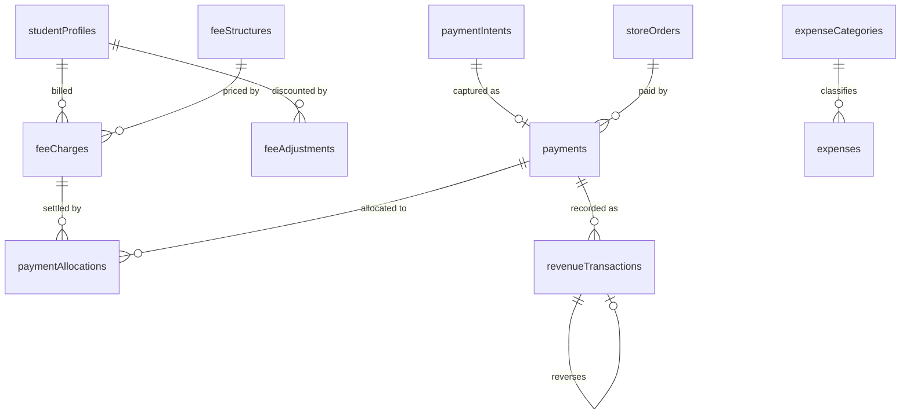
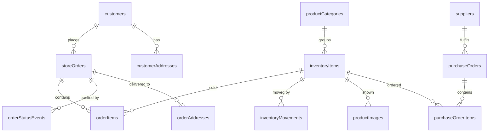

# Database

One Postgres database, 68 tables, defined in `packages/db/schema/` and split by
domain. Modules are ordered by dependency — identity first, then everything
that references it — and that order must stay acyclic.

| Module | Holds |
|---|---|
| `enums.ts` | Every status and type enum |
| `identity.ts` | `people`, `users`, `roles`, `permissions`, joins |
| `academics.ts` | Courses, modules, intakes, classes, sessions, assessments |
| `admissions.ts` | Applications and their documents |
| `students.ts` | Student profiles, enrolments, attendance, results, certificates |
| `inventory.ts` | Items, movements, categories, suppliers, purchase orders |
| `commerce.ts` | Customers, addresses, carts, orders, coupons |
| `finance.ts` | Fee structures, charges, payments, allocations, revenue, expenses |
| `staff.ts` | Staff profiles and assignments |
| `operations.ts` | Appointments, media, notifications, audit, settings |
| `cms.ts` | Pages, banners, gallery, blog, testimonials, FAQs, events |

## The identity spine

The brief is explicit that a customer may later become an applicant and then a
student, and that this must not create three people. `people` is the canonical
record; every profile table points at it.



`resolvePerson` finds an existing person by email, then by phone, before
creating one — so the shopper who applies six months later keeps one record and
gains a second facet.

Contact columns are duplicated onto `applications` and `storeOrders` on
purpose: those are point-in-time snapshots of what was declared, and must not
change when the person edits their profile later.

## School



Attendance carries `unique(enrollmentId, classDate)` — one mark per student per
day, so re-marking corrects rather than duplicates.

## Money



The student account equation from the brief is computed, never stored:

```
Total fees − discounts + additional charges − payments = outstanding
```

`payments.transactionReference` is unique where present, so the same gateway
reference cannot be booked twice.

## Commerce and stock



`inventoryItems` is deliberately both the product record and the stock record.
Splitting them would create two numbers that can disagree; the brief asks for
inventory to be centralised, and one row is the strongest way to guarantee it.

`inventoryMovements` is append-only and carries `balanceAfter`, so any past
stock level can be reconstructed.

## Conventions

- **Foreign keys everywhere**, with deletes chosen per relationship:
  `cascade` for children that cannot outlive their parent (order items),
  `restrict` for records that must not silently disappear (a course with
  enrolments), `set null` for optional links (the staff member who recorded
  something).
- **Indexes** on every foreign key used for lookup, plus status and date
  columns the dashboards filter on.
- **Soft deletes** (`deletedAt`) on records with history worth keeping —
  people, students, courses, items, orders, expenses. Ledger tables are never
  soft-deleted; they are append-only.
- **Money** is `numeric(12,2)`, read as a string, and parsed digit by digit
  into minor units before any arithmetic.
- **Timestamps** are `createdAt`/`updatedAt` with `$onUpdate`.

## Migrations

```bash
pnpm db:push          # drizzle-kit generate && drizzle-kit migrate
```

Migrations run over `DIRECT_DATABASE_URL` (the non-pooled endpoint) and each
file is applied in a transaction, so an interrupted run rolls back rather than
leaving the schema half-changed.

## Seeding

```bash
pnpm db:seed          # foundation only: courses, stock, clinic services
pnpm db:seed:demo     # adds a demo school
```

The demo seed is resumable — every entity is keyed and skipped if present — and
batched, because seeding a remote database one row at a time does not finish.
It refuses to run when `NODE_ENV=production`.

## Reconciliation

```bash
pnpm db:reconcile
```

Rebuilds derived values from their source of truth:

1. A revenue line for every completed payment that lacks one.
2. `feeCharges.amountPaid` recomputed from allocations.
3. A movement wherever the stock ledger does not explain quantity on hand.

The running system writes these together in a transaction, so drift should not
occur. This exists for the cases where it can anyway: an interrupted import, a
restore from backup, or data written before a rule existed.
