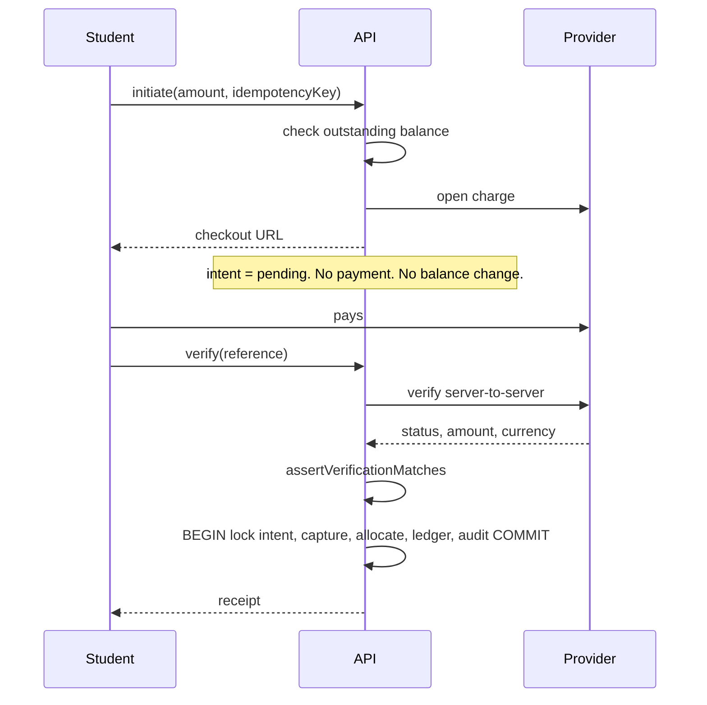

# Security

## Authorisation

Roles come from the brief (§33) and live in `packages/shared/permissions.ts`,
shared by the API and the dashboards so there is one vocabulary.

| Role | Reach |
|---|---|
| Super Admin | Everything, including permissions added later |
| Administrator | Students, applications, courses, attendance, content, reports |
| Instructor | Assigned classes and students, attendance, results |
| Accountant | Fees, payments, expenses, revenue, financial reports, salaries |
| Storekeeper | Inventory, purchases, suppliers, stock movement |
| E-Commerce Manager | Products, orders, customers, sales, inventory |
| Student / Customer | Portal access only, no back-office permissions |

Super Admin is a wildcard rather than a list, so a permission added next month
is never silently withheld from the owner.

### How it is enforced

```ts
// The procedure refuses before it queries anything.
recordStudentPayment: permissionProcedure("payments.write")
```

Three layers, only one of which is a control:

1. `NAV_SECTIONS` hides menu items — **presentation**.
2. `<PermissionGate>` hides pages — **presentation**.
3. `permissionProcedure` refuses the call — **the control**.

A caller who forges the UI reaches an empty page and a string of `FORBIDDEN`
responses. Tests assert that every permission-gated endpoint rejects an
anonymous caller before doing any work.

Grants are read from the database, so an owner can retune a role without a
deploy; the static catalogue is the seed and the fallback for a cold database.

### Salary

`staffProfiles.salary` requires `staff.salary.read`, which only the accountant
and ownership roles carry. A test asserts the other roles do not have it.

## Payments

The rule from §49 is that a payment is only successful once the server has
asked the provider. `packages/api/services/gateway.ts` is the only place that
may say so.



`assertVerificationMatches` rejects a charge that is not succeeded, whose
amount differs by a single pesewa, or whose currency differs. The attack it
blocks is paying GHS 1 and claiming a GHS 500 intent is settled.

In production a gateway must be configured. `getGateway()` throws rather than
falling back to a stub that could be coaxed into approving a payment. The
development stand-in never reports success on its own — a developer confirms
through an endpoint that refuses to run in production.

### Webhooks

`/api/webhooks/paystack` verifies an HMAC-SHA512 over the **raw request body**
with a length-checked `timingSafeEqual`. It is a route handler rather than a
tRPC procedure precisely because the signature covers the exact bytes sent.

Even a correctly signed body is not believed: the handler still re-verifies the
charge with the provider. Delivery is deduplicated by a unique
`(provider, eventId)`, and a handled duplicate returns 200 so the provider
stops retrying.

## Uploads

`validateDocumentUpload` checks three things (§58):

1. The declared MIME type is on the allow-list.
2. The decoded size is between 1 byte and 8 MB.
3. **The bytes match the declared type** — `%PDF`, the PNG signature, the JPEG
   marker, `RIFF`/`WEBP`.

The third is what stops a renamed executable being accepted as a transcript.
Filenames are stripped of everything outside `[a-zA-Z0-9._-]`, so path
separators cannot survive.

Student documents are stored as authenticated Cloudinary resources and served
through an authorising proxy — never a predictable public URL.

## Audit

Every sensitive action writes an immutable row inside the same transaction as
the change, so the log cannot record something that rolled back.

```
user · action · entity · entityId · oldValue · newValue · IP · agent · timestamp
```

Covered: payments and refunds, fee charges, discounts and surcharges, expense
approval, stock movements, purchase orders and receiving, order status changes,
certificates issued and revoked, role grants and revocations, setting changes.

`diffFields` reduces a change to only what actually differed, so the log stays
readable instead of storing two full records.

## Input and output

- **Every procedure validates with zod**, with bounded string lengths and
  integer checks.
- **Page size is capped at 100**, so no client can ask for the whole table.
- **Search terms are escaped** before becoming a `LIKE` pattern — typing `50%`
  searches for the literal text rather than matching every row.
- **Queries are parameterised** through Drizzle; the one place a list of ids is
  needed uses `inArray`, not string interpolation.
- **CSV exports prefix formula characters**, so a cell beginning `=` opens as
  text rather than executing in a spreadsheet.

## Secrets

Never in frontend code. Only `NEXT_PUBLIC_*` reaches the browser, and that is
limited to the app id and OAuth portal URL. Everything else — database
credentials, the payment secret, Cloudinary keys, the JWT secret — is read
server-side through `packages/env`.

## Known gaps

Worth stating plainly rather than leaving to be discovered:

- **Two-factor authentication** is modelled (`users.twoFactorEnabled`) but not
  implemented. No secret is stored yet.
- **Rate limiting** is not implemented. It belongs at the edge — the certificate
  verification endpoint and the OAuth callback are the first two that need it.
- **Notification delivery** writes queued rows; the transport that drains them
  is not built, so email, SMS and WhatsApp are recorded rather than sent.
- **Field-level encryption** is not applied to student documents beyond
  Cloudinary's authenticated delivery.
